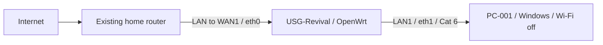
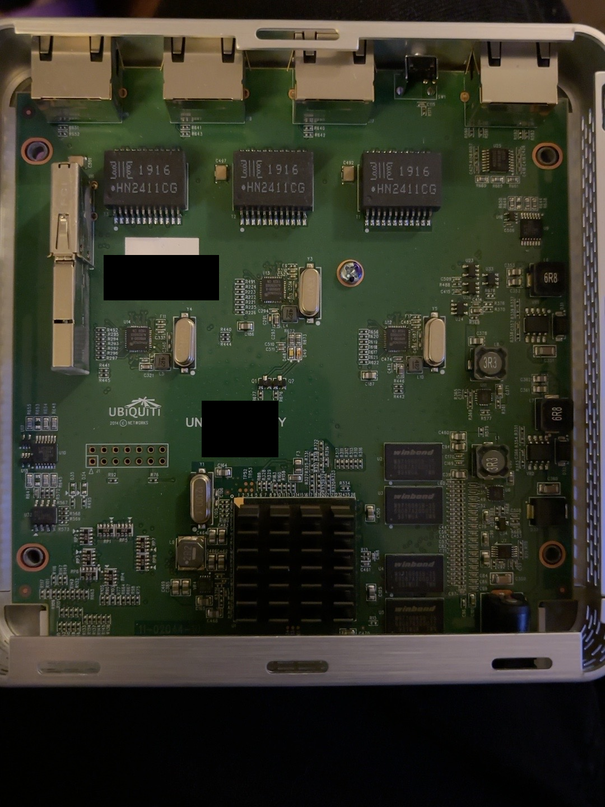
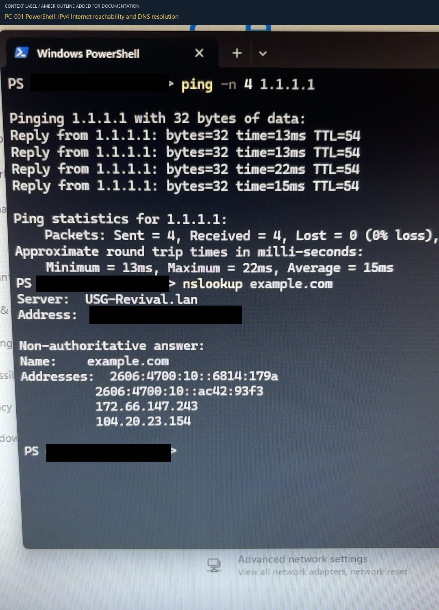

# USG Revival

**Repurposing a donated Ubiquiti UniFi Security Gateway with OpenWrt.**

I opened the USG, preserved its original USB contents, inspected the files, and installed OpenWrt on the stock drive. The result is a working router in a controlled test setup: PC-001 can reach the Internet, resolve names through the USG, and load a webpage. The saved hostname survived a reboot, the updated administrator password works, and the visible firewall-zone policies match OpenWrt's defaults.

**Maintainer:** [Misael Reyna](https://github.com/MReyna22)  
**Equipment:** GW-001 from [SLB Corona Donated Gear](https://github.com/MReyna22/slb-corona-donated-gear)  
**Work completed:** October 3–4, 2026  
**Status:** Basic revival and functional validation complete. Home-network deployment is a separate project.

## Why I did this

I wanted to see what I could accomplish with the equipment I already had. This USG gave me a chance to open an appliance, understand how it boots, preserve what was on it, and make a deliberate change that I could test and document.

My personal goal is to show resourcefulness, curiosity, persistence, and practical troubleshooting. I want the evidence to show how I reached the result, including the decisions and corrections along the way. This is one of the first hands-on projects to come out of the equipment Antonio Corona donated for my IT and cybersecurity home lab.

## Result at a glance

| Check | Observed result | Evidence |
|---|---|---|
| Installed firmware | OpenWrt 25.12.5 r33051-f5dae5ece4; kernel 6.12.94 | [E041](evidence/assets/07-first-boot/41-openwrt-status-system-overview.png) |
| USB installation | Kernel comparison and root-filesystem read-back passed | [E039](evidence/assets/06-openwrt-installation/39-openwrt-installation-complete.png) |
| Persistent setting | `USG-Revival` hostname retained after restart | [E043](evidence/assets/08-reboot-validation/43-openwrt-hostname-after-reboot.webp) |
| Administrator access | Logout and fresh login with changed password succeeded | Direct operator report |
| Configuration backup | Generated and kept private | Direct operator report |
| Ethernet | LAN1 / eth1 linked at 1 GbE | [E042](evidence/assets/07-first-boot/42-openwrt-memory-storage-and-port-status.webp) |
| WAN | DHCP lease obtained from the existing router | [E045](evidence/assets/09-wan-validation/45-openwrt-wan-dhcp-lease.png) |
| IPv4 reachability | Four replies from `1.1.1.1`; 0% loss; 15 ms average | [E046](evidence/assets/09-wan-validation/46-pc001-internet-ping-and-dns.png) |
| DNS | `example.com` resolved through `USG-Revival.lan` | [E046](evidence/assets/09-wan-validation/46-pc001-internet-ping-and-dns.png) |
| Web access | `example.com` loaded in Edge on PC-001 | Direct operator report |
| Firewall zones | LAN → WAN forwarding; WAN input reject; WAN IPv4 masquerading enabled | [E047](evidence/assets/10-firewall-review/47-openwrt-firewall-zone-settings.png) |

The firewall check records the visible configuration. Inbound enforcement, throughput, long-term reliability, and public IPv6 connectivity were not tested. See the [validation record](docs/04-validation.md) for the method and limits of each result.

## Explore the project

| Document | What it covers |
|---|---|
| [Preservation](docs/01-preservation.md) | Original USB acquisition, integrity checks, and private evidence handling |
| [Filesystem analysis](docs/02-filesystem-analysis.md) | Three partitions, paired OEM firmware files, and checksum comparisons |
| [OpenWrt installation](docs/03-openwrt-installation.md) | Pinned release, stock-drive decision, partition strategy, and recorded commands |
| [Validation](docs/04-validation.md) | Boot, persistence, WAN, DNS, browsing, and firewall-zone results |
| [Decisions and lessons](docs/05-decisions-and-lessons.md) | Constraints, revised assumptions, and what I learned |
| [Evidence and privacy](docs/06-evidence-and-privacy.md) | Permanent redactions, metadata removal, captions, and publication checks |
| [Evidence index](evidence/README.md) | All 46 reviewed images, organized by phase |
| [References](docs/references.md) | Official OpenWrt and Microsoft sources |

## Test setup



The USG LAN used the default `192.168.1.0/24` network. The upstream network used a different private `/24`, so the two sides did not overlap. The existing router stayed in place during testing. Private upstream addresses and device identifiers are removed from the public evidence.

## From inspection to working router



*E001 — The opened USG and its internal USB boot media.*



*E046 — PC-001 reaches a public IPv4 target and resolves a domain through the revived USG.*

## Repository contents

```text
README.md
CHANGELOG.md
docs/                  Recovery narrative, decisions, validation, references
evidence/
  README.md            Captioned index of all publication images
  evidence-gallery.html Local browser gallery
  image-manifest.json  Publication image hashes and review information
  assets/              Reviewed PNGs grouped by project phase
  results/             Sanitized structured observations and verification records
scripts/
  install-stock-usb.sh Recorded installation script used in this project
  verify-publication.py Image hashes, PNG metadata, and local-link checks
```

Full disk images, firmware exports, raw configurations, passwords, and unsanitized originals remain outside this repository. The installation script is a record of the specific guarded procedure used; read the [installation document](docs/03-openwrt-installation.md) before considering it for another device.

## Acknowledgment

Thank you, Antonio Corona, for donating this equipment and giving me an opportunity to put what I have learned into practice. This project is part of the progress I wanted to make with that opportunity.

Antonio is acknowledged as the hardware donor. The project decisions, hands-on work, and test results are my responsibility. I used AI assistance to organize the investigation, prepare commands, review evidence, redact publication copies, and assemble the documentation; I performed the physical work and device-side tests.
